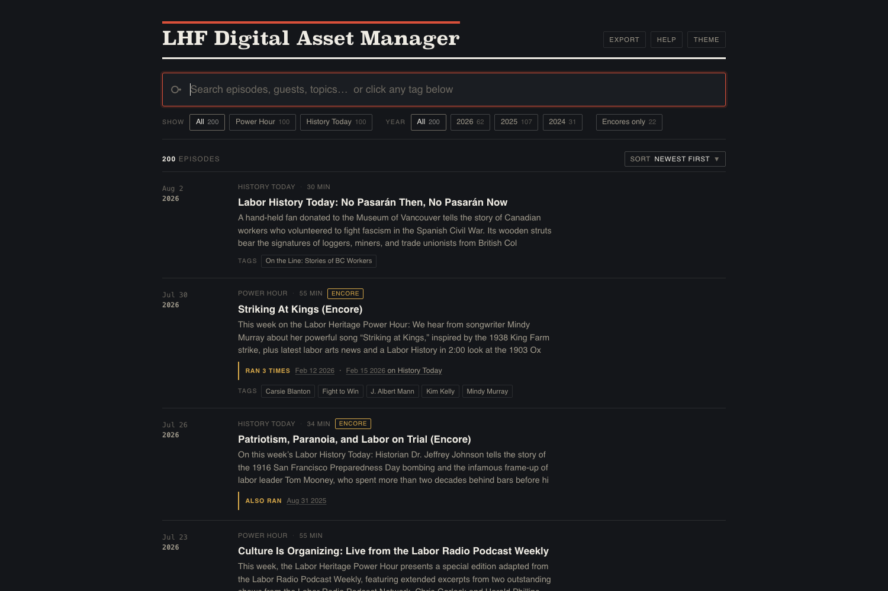
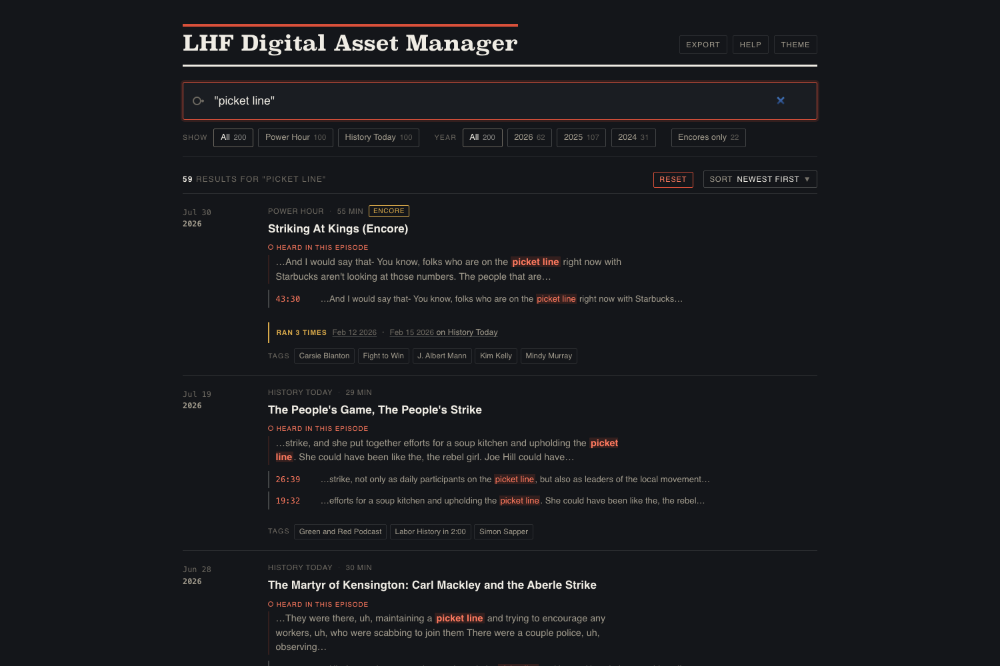
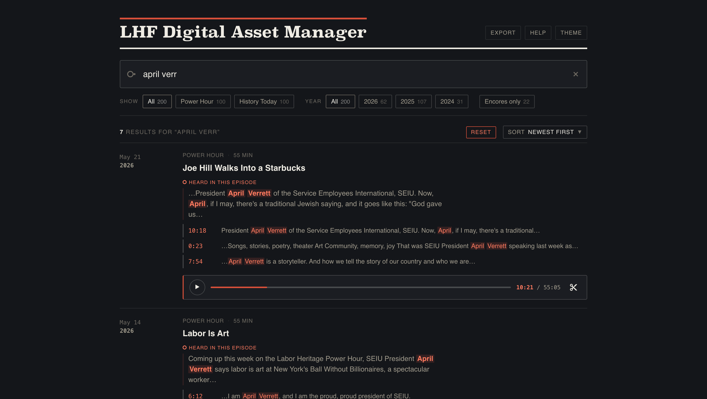
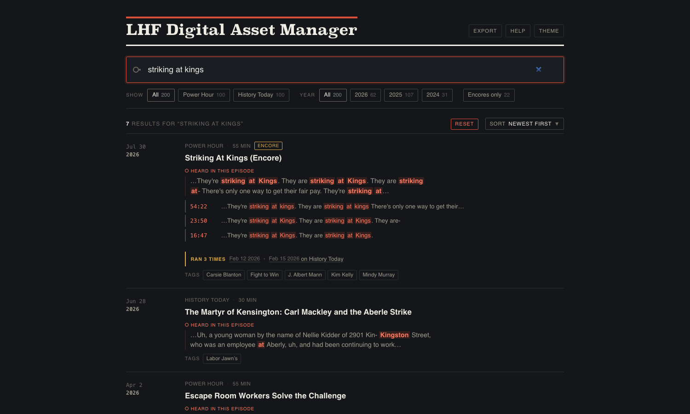
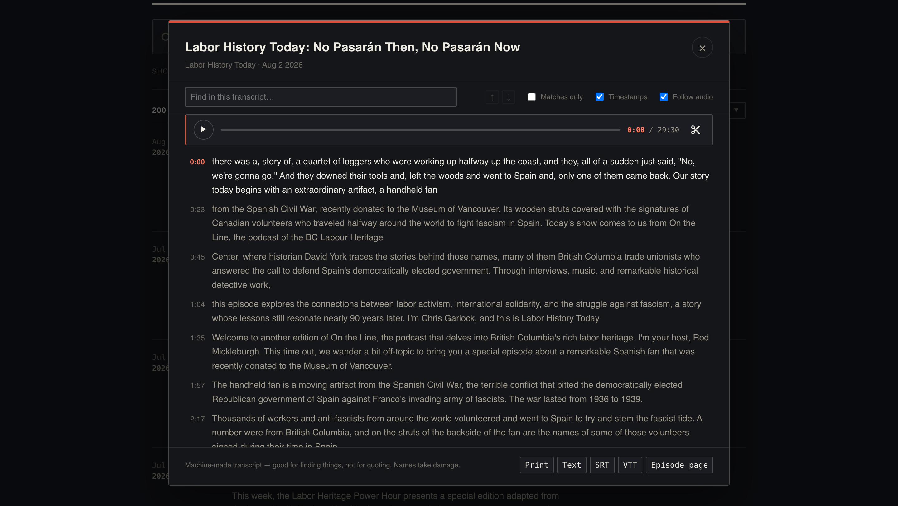
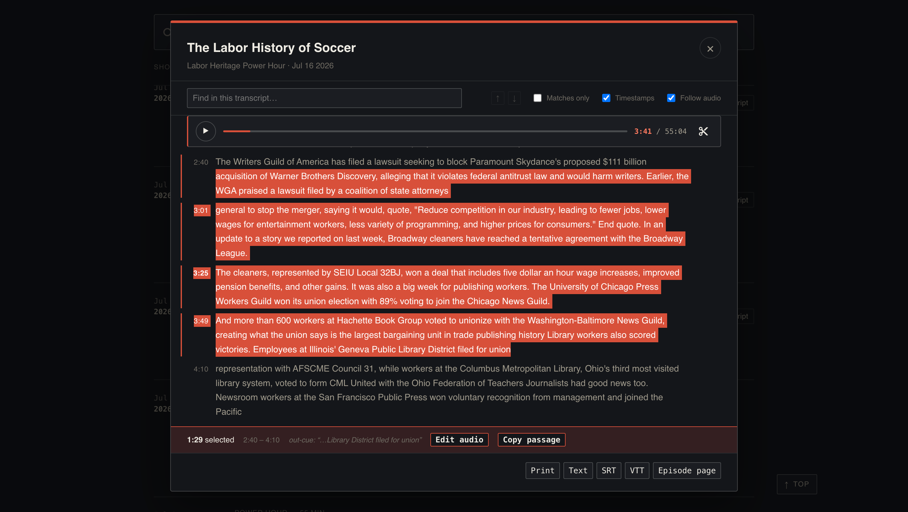
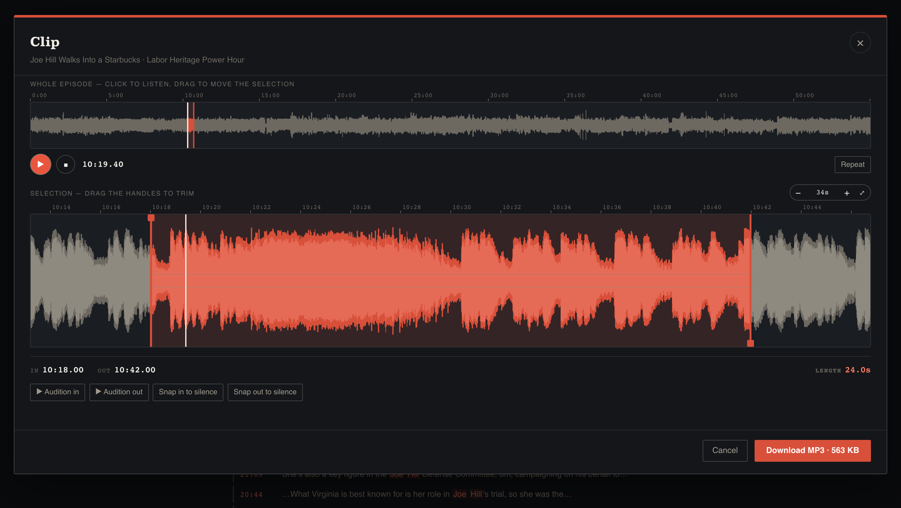
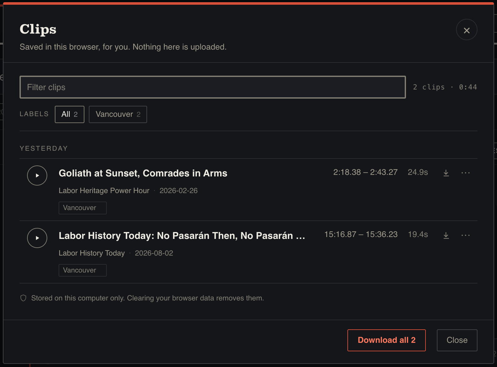
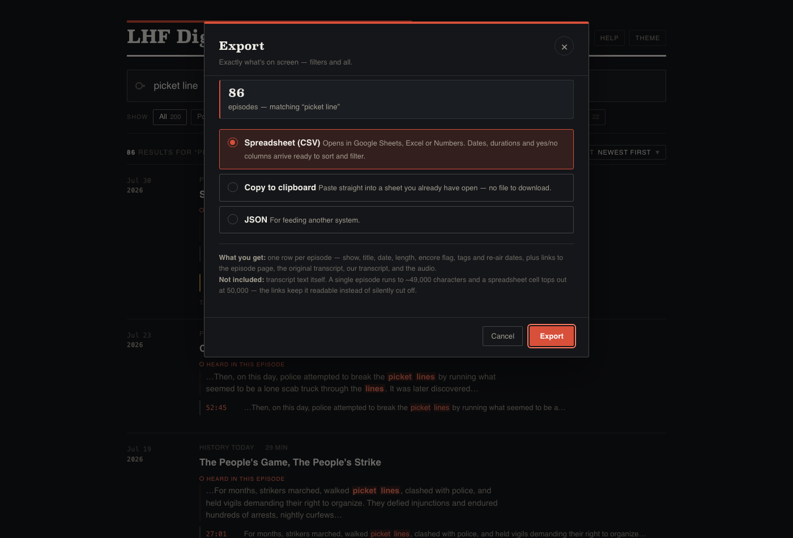

# LHF Digital Asset Manager

**https://lhf-tools.supersoul.top**

Harold's email asked for a catalogue of the guests, topics and interviewers
across both shows — pulled from what you've already published as well as what's
coming — searchable, so you can find an older show worth replaying, check
whether something is already in the can, and eventually put a search box on
laborheritage.org.

That's what this is. One discovery along the way changed the plan.

---

## What changed

My original suggestion was to pay for AI transcription: run both shows through
speech-to-text to get the words *and* the timings, so search could reach inside
the audio and jump you to the moment something was said. That was the expensive
part of the estimate.

Then I looked properly at your feed. **It already publishes transcripts, timings
and all** — your editing software writes them, Podbean carries them, and they've
been sitting there in public the whole time.

That's exactly what the AI step was going to produce. So it isn't needed:
**144 of 200 episodes came with a full transcript, free.** No transcription
bill, no new vendor, nothing extra for you to do, and new episodes arrive the
same way.

---

## What it does

**200 episodes · 143 hours · both shows**, checking for new episodes every 15
minutes. The footer tells you when it last looked.

**It searches what was said, not just the show notes.** Searching the phrase
*"picket line"* finds 59 episodes — only **2** mention it in the written
description. The other 57 turned up because someone said it out loud. Click a
timestamp and the episode plays from that second.

**It spots repeats.** The archive works out when a programme has aired more than
once and says so under the episode: **8 repeated on the same show, 5 that ran on
both** — including *Striking At Kings* and *MLK in Memphis*.

**It opens the transcript.** Every episode that has one — 144 of the 200 — has
a **Transcript** button. It opens the whole thing, already marked up with
whatever you just searched for.

**Two gestures do most of the work.** Everything else is a refinement of them:

- **Click a line to hear it.** Anywhere on the line, or its timestamp. Tick
  **Follow audio** and the transcript scrolls along as it plays, so the words
  keep pace with the sound.
- **Drag across the text to select a passage.** The bar along the bottom tells
  you exactly how long it runs, where it starts and ends, and its **out-cue** —
  the last few words before it ends, so whoever's on the desk knows when to
  come back. **Edit audio** opens that selection in the clip editor; **Copy
  passage** takes the words.

Beyond those:

- **Edit** on a single line does the same for just that line, and is always
  showing on lines that matched your search
- **Search within the episode**, using the same shortcuts as the main search
  box, with a running count and arrows to step between hits
- **Matches only** — collapse a 55-minute show down to just the lines that
  mention the thing you're after
- **Print it**, or download it as plain text, or as subtitles (SRT / VTT)

The two together are the bit worth dwelling on. Finding the moment is the hard
part of making radio, and you find it by reading, not by staring at a waveform.
So: search for the thing, tick **Matches only** to strip the episode down to
the lines that mention it, and press **Edit** on the one you want. You're in
the waveform, on that passage, without having scrubbed through anything.

Or drag across a longer stretch, and the archive tells you it runs 1 minute
6 seconds before you cut anything.

**It cuts clips.** Press the scissors on the player and you get the waveform
with that passage already selected. Drag the handles, zoom in, snap the cut to
the gap between words, listen back, download the MP3. It's copied out of the
original file rather than re-recorded, so it's identical to what went out, and
the filename carries the show, date and timecode.

The editor is built around listening, because that's how an edit is actually
judged:

- **Play and pause**, with a timeline above each waveform so you always know
  where you are. <kbd>Space</kbd> plays and pauses from anywhere.
- **Back to the start** — the skip-back button beside Play returns to the
  beginning of your selection and brings the view with it, so it's also the way
  back if you've wandered off listening somewhere else in the episode.
- **Repeat** keeps the selection going round while you move the handles, so you
  hear each adjustment come back without stopping and starting.
- **Click anywhere on the top waveform** to listen from that point — for
  finding a moment when you don't yet know where it is.
- **Hear the start** and **Hear the end** play the clip's own first and last
  three seconds. Neither ever plays outside your selection, so what you hear is
  what the listener gets — whether it opens mid-word, whether it stops
  mid-sentence.
- **Mark as you listen** — press <kbd>I</kbd> where the clip should start and
  <kbd>O</kbd> where it should end, and the point lands exactly where you heard
  it. <kbd>[</kbd> and <kbd>]</kbd> jump the cursor between the pauses in
  speech, which is usually the fastest way to the edge you want.

Setting the two ends, in whichever way suits what you're doing:

- **Drag across the lower waveform** to select — both ends in one movement,
  rather than moving two handles in turn. Drag in either direction.
- **Click the lower waveform** to put the cursor exactly where you clicked,
  without starting playback, then press <kbd>I</kbd> or <kbd>O</kbd>.
- **Drag the red handles** to adjust either end afterwards, or nudge a selected
  one with the **arrow keys** — 0.1 second a press, a full second with
  <kbd>Shift</kbd>. With no handle selected the arrows walk the cursor along by
  the same steps.
- **Undo** with <kbd>⌘</kbd><kbd>Z</kbd> if a drag or a mistimed key loses a
  selection you wanted. It's one step back, and pressing it again puts your
  selection forward again.
- Press <kbd>?</kbd> at any point for the full list of keys, without leaving the
  editor.

**The lower waveform is drawn in detail** — solid through the middle for how
loud a moment really is, outlined for how far it peaked, with two faint lines
marking that episode's own silence. The gaps between words are visible, so you
can see the pause you're cutting into rather than guessing at it, and zoom right
down to a fraction of a second on one edge.

**It remembers the clips you make.** Finding a moment in 143 hours is the hard
part, and it used to be work you did again every time — cut a clip, and the only
record you ever found it was a file in a downloads folder.

Now **＋ Add to library** in the editor saves it. You get a short dialogue to
name it and add **labels** — *promo*, *intro*, *out-cue*, whatever suits how you
work — and it saves **without closing the editor**, so you can nudge a handle and
keep a second version of the same quote when you can't decide between two
endings.

**Clips** at the top of the page opens the list:

- **Hear one without opening the editor** — press play and a scrubber appears on
  that row; click along it to move within the clip
- **Rename** by clicking the title, **re-open** it to adjust the edit, or
  **download** it again from the arrow on the row
- **Copy link** from the **⋯** menu gives you a web address that opens the
  editor on exactly that passage — send it to someone instead of describing
  where to look
- **Filter by label.** The ones you use most sit across the top; pick two and you
  get only the clips carrying both
- **Grouped by when you saved them** — today, yesterday, last week
- **Nothing is deleted without a ten-second undo**

**Download all** packs the lot into one zip, and asks you to name it and add a
note first. The note goes inside as a text file next to a list of every clip with
its show, date, times and labels — so a folder found next March still explains
itself. If you've filtered by a label, the button says **Download these 3**
instead, and the file is named `-filtered`, so a partial bag can't be mistaken
for the whole library.

One thing to know, and it's in the dialogue too: **saved clips live in your
browser, on that computer.** Nothing is uploaded. They work with no internet,
they're yours alone, and they don't follow you to another machine — clearing
your browsing data removes them. The audio is never at risk, only the record of
what you found, and a downloaded MP3 is a normal file that outlives all of it.
See **Where things are kept** below.

**Tags** — 232 people, bands, museums and books, taken from the links in your
own show notes rather than guessed. Click one to see every episode featuring it.
(These are different from the **labels** on your clips: tags come from your show
notes and are the same for everyone; labels are yours.)

**Export** — a spreadsheet of the archive, with links back to each episode, its
transcript and the audio. You choose how much: **this search** gives you exactly
what's on screen, filters and all; **everything** gives you all 200 episodes.
Both counts are shown, so you always know which file you're about to get. CSV
for Sheets or Excel, straight to the clipboard, or JSON.

Before downloading, **What's in the file, exactly** lists every column in plain
English and shows the first couple of rows of your actual file.

**And there's a fourth option: the archive package.** One `.zip` containing the
spreadsheet, every transcript as a readable text file, every spoken line with
the second it was said, and a README explaining all of it. The whole archive —
200 episodes, 144 transcripts, 14,937 passages — comes to **under 4 MB**, small
enough to email.

It's worth knowing what that file is, because it's more than a download:

- **It doesn't need this website.** Everything in it is plain text — CSV, JSON
  and .txt. Anyone could read it, now or in twenty years, with no special
  software and without this site still existing.
- **It's a copy you hold.** Given the feed limit above, that matters more than
  it used to.
- **The filename tells you what it is.** Export everything and you get
  `…-complete.zip`; export a filtered view and you get `…-filtered.zip`, with a
  note inside saying so. A partial export is perfectly useful, but it isn't a
  backup, and a year later nothing else would tell you which one you had.

Audio isn't inside it — only links to it. All 143 hours would be 8–12 GB, which
is a download rather than a file. That's worth holding alongside the
**100-episode limit** section above: this package preserves everything *except*
the recordings.

**Links** — the address bar always matches what you're looking at, so any search
can be pasted to a colleague, or pointed at a single moment. That's also how a
search box on laborheritage.org would work.

---

## Using it

Just type — results narrow as you go. Beyond that:

- **"in quotes"** for an exact phrase
- **strike NOT encore** to exclude; `AND` and `OR` work too
- **organiz\*** catches organize, organized, organizing, organizers
- Filter by show, year or encores; sort by **longest / shortest** when you're
  filling a slot of a certain length
- **More** at the end of a description opens the rest of the show notes
- **Transcript** opens the full transcript, with the same search inside it
- **Help** explains the rest, with examples you can click to run

---

## Two things to know

**The transcripts are machine-made** — good enough to find things, but names
take some damage. Fine for searching, not for quoting.

**The archive is backed up.** The server takes snapshots and full backups on a
two-week rotation, and the archive package below is a third copy you can hold
yourself, independent of this software entirely.

---

## About the 100-episode limit

This is the one thing on this page worth reading twice, and it's a question for
you rather than a problem with the archive.

**Podbean carries the most recent 100 episodes per show.** Both shows are now
sitting at exactly that number. So from the next episode each of you publishes,
the oldest one drops off the end.

**What the archive keeps, permanently:** the episode, its description, its full
transcript, every timestamped line, the tags, the re-air detection, and any
clips you've marked. None of that depends on Podbean once we've read it. Search
keeps working. The words stay findable.

**What the archive doesn't hold: the recordings.** Audio streams from Podbean
straight to your browser — we store the address, not the file. That has been the
right arrangement, and it's why the whole thing is small enough to email. But if
an episode leaves Podbean and the file goes with it, then in here that episode
becomes readable and searchable but **no longer playable**, and clips can't be
cut from it.

**Good news, and we tested it rather than assumed it.** Three episodes have now
dropped off the end of the feed:

| Show | Date | Title |
|---|---|---|
| Power Hour | 12 Sep 2024 | The power of our stories |
| Power Hour | 19 Sep 2024 | Shift Happens |
| Labor History Today | 22 Sep 2024 | The Disney Revolt (Encore) |

**All three still play, and clips can still be cut from them.** Checked
13 August 2026. Falling off the feed does not delete the recording — Podbean
stops *listing* the episode, but the file stays where it was, and the address we
saved still reaches it.

So the thing to worry about isn't an episode ageing out. It's an episode being
**deleted**, which is a different event and one only Podbean can tell you about.

**One consequence worth being plain about:** those three episodes are no longer
listed anywhere on Podbean, so this archive is now the only place that still
knows where their audio lives. The recordings are fine; the *addresses* exist
here and nowhere else. That is a good argument for keeping a copy of the archive
package — see above — quite apart from the question below.

### The question

**Do you keep your own copies of the finished episodes?**

If you do — masters, Descript projects, a drive somewhere — then this is
housekeeping. The archive keeps everything it already has, and re-pointing it at
your copies is straightforward whenever it matters.

If you don't, and Podbean has been the only copy, then that's worth knowing
soon, because it changes what this software should be doing. We would want to
start keeping the audio here as well as the catalogue — technically simple, but
a real change in what the archive is, and one worth deciding on purpose.

It is less urgent than it looked, now that we know ageing out of the feed leaves
the recording intact. It is still the question that decides what this software
should become.

Two related things while you're asking Podbean:

- **What happens when an episode is actually deleted** — does the file go with
  it? We know now that *ageing off the feed* leaves the audio in place; deletion
  is the case still worth asking about, along with whether the transcript and any
  AI work you've paid for survive it.
- **How long do unlisted files stay?** The three above are still served but no
  longer listed. Whether that lasts indefinitely is Podbean's policy, not
  something we can measure from outside.
- **The older backlog.** Everything before September 2024 was already out of
  reach of the feed. If you want it in here, it's a one-time job through
  Podbean's back-end, and it gets no easier with time.

Nothing here needs doing this week. The first question is the one that decides
the rest.

---

## Where things are kept

Short section, but it decides what's shareable and what isn't, so it's worth
being plain about.

**The archive itself is on the server.** The 200 episodes, the transcripts, the
tags, the search — one copy, the same for all of you, wherever you open it from.
That's the part being backed up.

**Some things live in your own browser**, not on the server:

| | |
|---|---|
| Light or dark | Rebuilt in one click if lost |
| A cache of waveforms you've opened, so a 30-minute show downloads once | Rebuilt automatically |
| **Your saved clips and their labels** | **Not rebuilt — this is the one to know about** |

The first two look after themselves. **Saved clips are the only thing in the
browser you can actually lose**: they're on that computer, and clearing your
browsing data takes them — not the audio, but the record of which moments you'd
found and what you called them.

If a list of clips ever matters enough that losing it would hurt, download them
as a zip; that file is yours and outlives everything. Same for a clip you've
downloaded — that's a normal file on your computer.

**The audio is a separate question, and it's the one below.** Everything the
archive plays, and everything the clip editor cuts from, streams from Podbean —
we hold the catalogue and the words, not the recordings. That's been the right
arrangement while Podbean is holding them. See **About the 100-episode limit**.

**A clip you download is a file on your computer**, like any other download. It
isn't stored in the site and never was.

**Right now, nothing you do here is visible to anyone else** — because there's
nowhere for it to go. The site can *read* the archive and nothing more; it
cannot write anything back. That's deliberate, and it's why there's no login:
everything it shows is already published, so there's nothing to lock down.

That one fact is what the next section keeps running into.

---

## Where it could go

Everything above was built by reading what's already published — the feed, the
show notes, the transcripts, the links you write yourself. **That approach has
now gone about as far as it can.** Nothing in the archive uses AI, and nothing
in it needs to.

The remaining items split into three kinds: **one question only you can answer**
(the recordings — see **About the 100-episode limit** above, and it's the one
that ranks first), one decision about AI, and things that are simply more work.

### The thing four features have in common

If you'd want the clips list to be **shared between you**, or to follow you to a
new laptop, that's a different piece of work — and it turns out to be the *same*
piece of work as three other things on this list:

| If you wanted… | It needs |
|---|---|
| To see each other's saved clips | The site to be able to save things, and a login |
| Clips that follow you to another computer | The same |
| Topics, full guest lists, segment boundaries | The same, plus the reading pass below |
| An admin screen — staff notes, fixing a wrong tag, marking a re-air | The same |

All four are waiting on one decision: **whether this site should be able to
write things down, and be locked behind a login when it does.** Today it can
only read, which is why it needs no password and why there's nothing here to
break.

It isn't a big job. It's just a decision worth making once, on purpose, rather
than arriving at sideways — so it's on this list rather than buried in the
technical notes.

### The decision: topics, and the rest of the reading

**Topics are the one part of the original list still missing**, and they're
missing for a specific reason — show notes describe an episode but never
classify it. Neither do the hashtags: `#LaborHistory` is on 176 of the 200.
Nothing to scrape. The only way to get topics is to have something read the
episodes.

The same reading picks up **guests who weren't hyperlinked** and **who was
interviewing** — the last two gaps in Harold's list.

I've built and tested that pass, so the groundwork is done and the plumbing is
in place. **I haven't run it**, because that's your call and your money, and
because it should be run from a proper admin screen rather than a developer's
laptop (more on that below).

What it would cost, measured against your actual archive rather than guessed:

| | |
|---|---|
| Reading all 200 episodes, once | **about $4** |
| Each new episode from then on | **about 2 cents** |
| Which, at two shows a week, is | **about $2 a year** |

Those numbers are small enough that cost isn't really the question. The
question is whether you want the archive to make judgements at all, and how
much you want it to make.

Once something is reading the episodes, the same pass could also give you:

- **Consistent summaries** — one or two lines per episode in a house voice,
  which is what a search box on laborheritage.org would show
- **Names fixed in the transcripts** — the machine transcripts mangle names,
  which is why they're searchable but not quotable; this would change that
- **Segment boundaries** — both shows run several items per episode, so this
  turns "find the episode" into "find the eight-minute piece"
- **"More like this"** — useful when something falls through and you need to
  fill the hour
- **Suggested re-airs** — topic plus duration plus how long since it last ran,
  ranked. This is the scheduling question the whole archive was built to answer

None of it is decided, none of it is running, and it's all worth a conversation
rather than an email — the six things above differ a lot in usefulness and
hardly at all in price.

### A thought before any of that: use the tag list you already have

There's a question hiding underneath "topics", and it's worth settling first
because it changes the answer: **what should the topics actually be called?**

Left to itself, anything reading 200 episodes will produce *unions*, *labor
unions* and *unionization* as three separate topics, and a list like that is
worse than no list — you can't browse it and you can't trust a count.

**You've already solved this elsewhere.** The Labor Arts & Culture Database uses
a fixed list of **34 topics in three groups** — Theme, Industry, and Social
Dimension — and it's already sorted roughly **6,000 films, quotes, songs and
history records** with it:

| Group | Some of the terms |
|---|---|
| **Theme** | Strikes & Lockouts · Organizing · Collective Bargaining · Child Labor · Labor Culture & Arts |
| **Industry** | Mining · Steel & Manufacturing · Textiles & Garment · Maritime & Dockworkers · Domestic Workers |
| **Social Dimension** | Civil Rights & Race · Women & Gender · Immigration · Working Class |

**The suggestion is simply: use the same 34 here.** Two things follow from it.

**One search could eventually cover everything you have.** Ask for *Mining* and
get the podcast episodes, the films, the quotes, the songs and the history
entries together. If this archive invents its own topic names instead, the two
collections never join up — and joining them later is much harder than starting
that way.

**It's the cheap version of the job.** Tagging 200 episodes by hand is about
seven hours of somebody's time, and then two more episodes every week, forever.
Agreeing a list of 34 terms is one meeting. And agreeing a labor-history
vocabulary is exactly the thing the **former Library of Congress people in your
group** are qualified to do — it uses their expertise instead of their
afternoons.

**How the tagging itself would work**, roughly, and most of it isn't AI:

1. **Pattern matching first, which costs nothing and uses no AI.** The other
   database already contains around 145 word patterns — *picket*, *walkout*,
   *card check*, *shop steward* and so on — that map straight onto those 34
   topics. Run those over 880,000 words of transcript and a good share of the
   archive tags itself, for free, the same way every time. Nobody has measured
   how much yet; that's an afternoon's work and worth doing before spending
   anything.
2. **AI only for what's left**, and only ever *choosing from the 34* rather than
   inventing its own. That's a much smaller and safer job — if it returns
   anything that isn't on the list, that's a fault we can catch automatically,
   which is not true of free-form topics.
3. **You approve.** Nothing gets written into the catalogue without a person
   saying yes, in the admin screen mentioned below.

**One point of accuracy, because it matters to your LC people.** That list of 34
is *informed by* Library of Congress labor subject headings — it isn't literally
them. The real headings are formal records with permanent reference numbers.
Linking each of your 34 to its official Library of Congress record is a small
one-time job, and it's what would make your catalogue properly citable and
shareable with other institutions. Worth deciding while the historians are
looking at the list anyway.

None of this is built and none of it is decided. It's here because it's a
better starting point than the question it replaces.

### The rest

1. **An admin screen** — the login from the table above, given a face. Somewhere
   to start a job and see what it did, and, quite separately from AI, to add a
   staff note, fix a wrong tag, or mark an episode as already re-aired. The
   archive can already store all three; there's just no way for a person to
   enter them.
2. **The rest of the archive** — everything older than the feed reaches.
3. **The search box** on laborheritage.org.
4. **Producer tools**, if they'd help: a "not aired since" list for scheduling,
   a run-sheet that totals durations against a target slot, one-click citations.

Happy to talk any of it through — or leave it as is. It's working and looking
after itself either way.
